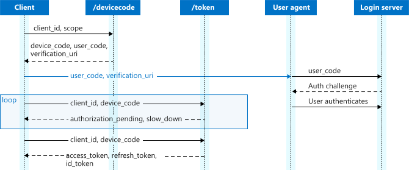
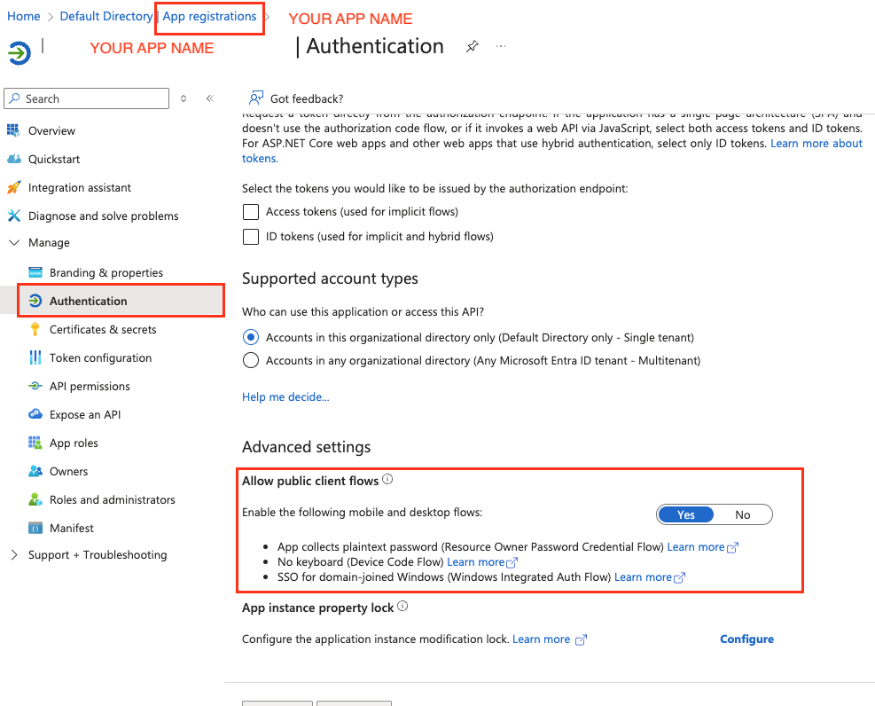
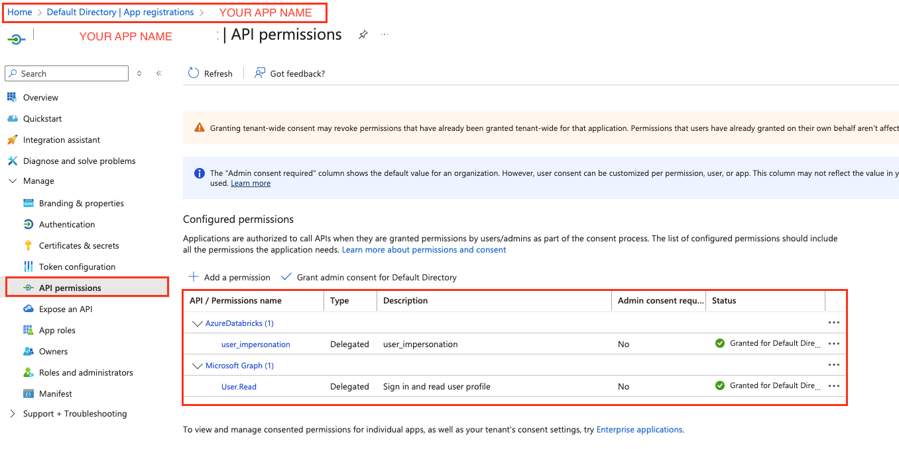

# Databricks Genie Bot (with OAuth via Microsoft EntraID)

## ✨ Objective

This project implements a chatbot using Databricks Genie with OAuth 2.0 authentication via Microsoft EntraID. Every call to the Genie API is tracked with the authenticated user's identity, ensuring governance and security.

## 🚀 Quick Start

### Prerequisites
- Python 3.10+
- Databricks workspace with Genie API access
- Azure application registration

### Installation

1. **Clone and navigate to project:**
   ```bash
   git clone <repository_url>
   cd genie_oauth_devicecode
   ```

2. **Install dependencies:**
   ```bash
   python3 -m venv .venv
   source .venv/bin/activate
   pip install -r requirements.txt
   ```

3. **Create and configure environment variables in `.env` file:**
   ```env
   TENANT_ID=your_azure_tenant_id -> Directory (tenant) ID
   CLIENT_ID=your_azure_client_id -> Application (client) ID
   DATABRICKS_HOST=https://your-workspace.databricks.com
   GENIE_SPACE_ID=your_genie_space_id
   SCOPE=2ff814a6-3304-4ab8-85cb-cd0e6f879c1d/.default
   ```

4. **Run application:**
   ```bash
   streamlit run app.py
   ```


## 📁 Project Structure
```
genie_oauth_devicecode/
├── app.py                      # Main application entry point
├── .env                        # Environment variables
├── requirements.txt            # Python dependencies  
├── README.md                   # Project documentation
├── modules/                    # Modular components package
     ├── __init__.py            # Package initialization
     ├── auth_handler.py        # Azure OAuth2 authentication
     ├── genie_client.py        # Databricks Genie API client
     ├── response_formatter.py  # Response formatting utilities
     ├── ui_components.py       # UI components and styling
     └── config.py              # Configuration management
```

## 🏗️ Architecture Overview

The application follows the architecture down below:

### Core Modules

1. **`app.py`** - Main application orchestrator
   - `GenieChatbot` class that coordinates all components
   - Session state management
   - Main application flow

2. **`auth_handler.py`** - Authentication management
   - `AzureAuthHandler` class for OAuth2 device code flow
   - User information retrieval from Microsoft Graph API
   - Authentication UI flow

3. **`genie_client.py`** - Databricks integration
   - `GenieClient` class for Genie API interactions
   - Async/sync wrapper functions
   - Workspace client management

4. **`response_formatter.py`** - Data formatting
   - `ResponseFormatter` class for clean data presentation
   - Markdown table generation
   - Error message formatting

5. **`ui_components.py`** - User interface
   - `UIComponents` class for reusable UI elements
   - Dark theme CSS styling
   - Message rendering functions

6. **`config.py`** - Configuration management
   - `Config` class for centralized settings
   - Environment variable validation
   - Configuration validation utilities

### 🏛️ Architecture Diagram

```
┌─────────────────────────────────────────────────────────────────────────────┐
│                           Genie AI Chatbot                                  │
│                         (Streamlit Frontend)                                │
└─────────────────────────────────────────────────────────────────────────────┘
                                       │
                                       ▼
┌─────────────────────────────────────────────────────────────────────────────┐
│                              app.py                                         │
│                       (Main Orchestrator)                                   │
│  ┌─────────────────┐ ┌─────────────────┐ ┌─────────────────┐                │
│  │  Session State  │ │  Flow Control   │ │  Error Handling │                │
│  │   Management    │ │   & Routing     │ │   & Logging     │                │
│  └─────────────────┘ └─────────────────┘ └─────────────────┘                │
└─────────────────────────────────────────────────────────────────────────────┘
          │                    │                    │                    │
          ▼                    ▼                    ▼                    ▼
┌─────────────────┐ ┌─────────────────┐ ┌─────────────────┐ ┌─────────────────┐
│                 │ │                 │ │                 │ │                 │
│ auth_handler.py │ │ genie_client.py │ │response_format  │ │ui_components.py │
│                 │ │                 │ │    ter.py       │ │                 │
├─────────────────┤ ├─────────────────┤ ├─────────────────┤ ├─────────────────┤
│• Device Code    │ │• Async Genie    │ │• Markdown Table │ │• Dark Theme CSS │
│  Flow           │ │  API Calls      │ │  Formatting     │ │• Chat Messages  │
│• User Info      │ │• Progress       │ │• Data Type      │ │• Sidebar        │
│  Retrieval      │ │  Tracking       │ │  Handling       │ │• Authentication │
│• Token          │ │• Error          │ │• Row Limiting   │ │  UI             │
│  Management     │ │  Handling       │ │• Stats Display  │ │• Responsive     │
│                 │ │                 │ │                 │ │  Design         │
└─────────────────┘ └─────────────────┘ └─────────────────┘ └─────────────────┘
          │                    │                              
          ▼                    ▼                              
┌─────────────────┐ ┌─────────────────┐                      
│                 │ │                 │                      
│ Microsoft       │ │   Databricks    │                      
│ Entra ID        │ │   Workspace     │                      
│                 │ │                 │                      
├─────────────────┤ ├─────────────────┤                      
│• OAuth 2.0      │ │• Genie API      │                      
│  Device Flow    │ │• Unity Catalog  │                      
│• User           │ │• SQL Execution  │                      
│  Authentication │ │• Data Access    │                      
│• Token          │ │  Control        │                      
│  Validation     │ │                 │                      
└─────────────────┘ └─────────────────┘                      
```

## 🔑 Key Features

### Functionality
- ✅ **Azure OAuth2 Device Code Authentication**
  - Secure device code flow implementation
  - No credential storage in application
  - User identity tracking for all API calls
  
- ✅ **Databricks Genie API Integration**
  - Async query processing with real-time progress
  - Statement execution API for robust data retrieval
  - Conversation state management
  
- ✅ **Rich Data Presentation**
  - Markdown table rendering with proper formatting
  - Numeric data formatting (commas, decimals)
  - Row limiting for large datasets
  - Truncation indicators
  
- ✅ **User Experience**
  - Dark theme responsive design
  - Sample questions sidebar for quick start
  - Real-time progress indicators
  - Comprehensive error handling and feedback
  
- ✅ **Enterprise Security**
  - Unity Catalog permission enforcement
  - Scoped access tokens
  - Session state management
  - Activity logging and monitoring

### Technical Implementation
- **OAuth 2.0 Device Code Flow** with Microsoft EntraID
- **Databricks Genie API** integration with chatbot.
- **Async Processing** with asyncio for non-blocking operations

## 🔐 Authentication and Authorization

This application implements the **OAuth 2.0 Device Authorization Grant Flow** (also known as "Device Code Flow") as specified in [RFC 8628](https://tools.ietf.org/html/rfc8628) and [Microsoft's documentation](https://learn.microsoft.com/en-us/entra/identity-platform/v2-oauth2-device-code).

### 🌐 OAuth 2.0 Device Code Flow Overview

The Device Code Flow is designed for input-constrained devices or applications where the user experience of entering credentials is challenging. Instead of entering credentials directly into the application, users authenticate on a separate device with better input capabilities (like a smartphone or computer).

### 📊 Flow Diagram
<p align="center">
   <p align="center">
      
   </p>
</p>


#### Down below you can viasualize better the specific OAuth flow diagram of this app

```
┌─────────────────┐                    ┌──────────────────┐                    ┌─────────────────┐
│                 │                    │                  │                    │                 │
│   Genie Bot     │                    │   Microsoft      │                    │   User Device   │
│  (Streamlit)    │                    │   Entra ID       │                    │   (Browser)     │
│                 │                    │                  │                    │                 │
└─────────────────┘                    └──────────────────┘                    └─────────────────┘
         │                                       │                                       │
         │ 1. Request device code                │                                       │
         ├──────────────────────────────────────►│                                       │
         │                                       │                                       │
         │ 2. Return device_code & user_code     │                                       │
         │◄──────────────────────────────────────┤                                       │
         │                                       │                                       │
         │ 3. Display user_code                  │                                       │
         │ & verification_uri to user            │                                       │
         ├───────────────────────────────────────┼──────────────────────────────────────►│
         │                                       │                                       │
         │                                       │ 4. User navigates to verification_uri │
         │                                       │◄──────────────────────────────────────┤
         │                                       │                                       │
         │                                       │ 5. User enters user_code & authenticates
         │                                       │◄──────────────────────────────────────┤
         │                                       │                                       │
         │ 6. Poll for token (with device_code)  │                                       │
         ├──────────────────────────────────────►│                                       │
         │                                       │                                       │
         │ 7. Return access_token (if auth complete)                                     │
         │◄──────────────────────────────────────┤                                       │
         │                                       │                                       │
         │ 8. Use token for Databricks API calls │                                       │
         │                                       │                                       │
```

#### **User Experience Flow**
1. **Initial Screen**: User clicks "🚀 Iniciar Autenticação"
2. **Code Display**: App shows the user code in large, copy-friendly format
3. **Redirect**: User clicks "🌐 Go to Microsoft Login" 
4. **Verification**: User completes authentication on their device
5. **Completion**: User returns and clicks "✅ I've Completed Authentication"
6. **Success**: Application receives token and redirects to chat interface

### 🛡️ Security Benefits

1. **No Credential Storage**: User credentials never pass through our application
2. **User Identity Tracking**: Every Databricks API call is associated with the authenticated user
3. **Scope-Limited Access**: Token only grants specific permissions:
   - `2ff814a6-3304-4ab8-85cb-cd0e6f879c1d/.default` (Databricks user impersonation)
   - `https://graph.microsoft.com/User.Read` (Basic profile information)
4. **Time-Limited**: Tokens have expiration times for security
5. **Unity Catalog Integration**: Databricks validates token and applies user's permissions

### 🔧 Error Handling

The implementation handles various OAuth flow states:

| Error Code | Meaning | Action |
|------------|---------|---------|
| `authorization_pending` | User hasn't completed authentication yet | Continue polling |
| `authorization_declined` | User denied the request | Reset flow |
| `expired_token` | Device code expired (15 minutes) | Restart flow |
| `bad_verification_code` | Invalid device code | Restart flow |

### 📋 App Registration Requirements

The Azure App Registration must be configured with:

- **Application Type**: Public client
- **Supported Account Types**: Accounts in this organizational directory only
- **API Permissions**:
  - `AzureDatabricks` → `user_impersonation` (Delegated)
  - `Microsoft Graph` → `User.Read` (Delegated)
- **Authentication**: 
  - Mobile and desktop applications: `Yes`
  - Device code flow: `Enabled`

#### Follow App Registration Config example

<p align="center">
   
</p></br>

<p align="center">
   
</p>

### 🔗 References

- [Microsoft OAuth 2.0 Device Code Flow Documentation](https://learn.microsoft.com/en-us/entra/identity-platform/v2-oauth2-device-code)
- [RFC 8628: OAuth 2.0 Device Authorization Grant](https://tools.ietf.org/html/rfc8628)
- [Databricks OAuth Integration Guide](https://docs.databricks.com/en/dev-tools/auth/oauth.html)


